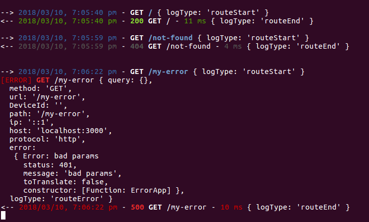

# koa-logger-middleware, a logger middleware for koa2 with **color** and customizable logger as **winstonjs**

[](https://npmjs.org/package/koa-logger-middleware "View this project on NPM")



## **Install**
```js
  npm install --save koa-logger-middleware
  // or
  yarn add koa-logger-middleware
```

## **Use**
```js
  import logger form 'koa-logger-middleware'
 
  app.use(logger({
    // your options
  }));
```

## **Options**: to see all option refer to index.js file

* **correlactionId**: [Boolean] - add an correlactionId and set header X-Correlation-Id to it.
* **logger**: [Object] - eg: winstonjs, by default is console with coloration.  
    ```js
    const winstonLogger = winston.createLogger({
      level: 'info',
      format: winston.format.json(),
      transports: [
        new winston.transports.Console({
          format: winston.format.simple(),
          colorize: true,
        })
      ]
    });

    logger({ logger: winstonLogger });
    ```
* **onStartFormat**: [Function] - format the string to log on request start: 
    ```js
    logger({ 
      onStartFormat(ctx) {
        const { start } = ctx.__logger;
        return `START: ${this.dateFormat(start)} - ${ctx.method} ${ctx.url}`;
      },
    });
    ```
* **onErrorFormat**: [Function] - same as onStartFormat but when error occurred
* **onEndFormat**: [Function] - same as onStartFormat but on response end
* **fillInfo**: [Function] - information that will be pass to the logger as 2 parameter. 
It can be usefull for example when you want to parse log to analize them or use it as big data
    ```js
    logger({ 
      fillInfo(ctx) {
        ctx.__logInfo = ctx.state.__logInfo = {
          query: ctx.request.query,
          method: ctx.request.method,
          url: ctx.request.url,
          DeviceId: ctx.request.get('DeviceId'),
          path: ctx.request.path,
          ip: ctx.request.ip,
          host: ctx.request.host,
          protocol: ctx.request.protocol,
          ...
        };
      },
    });
    ```
* **onError**: [Function] - call when an error occurred. Here you can handle error are whatever

## License

  MIT © [YSO Corp](http://ysocorp.com/)
